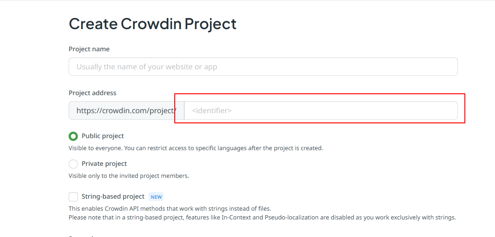
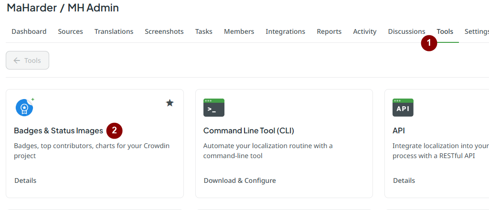
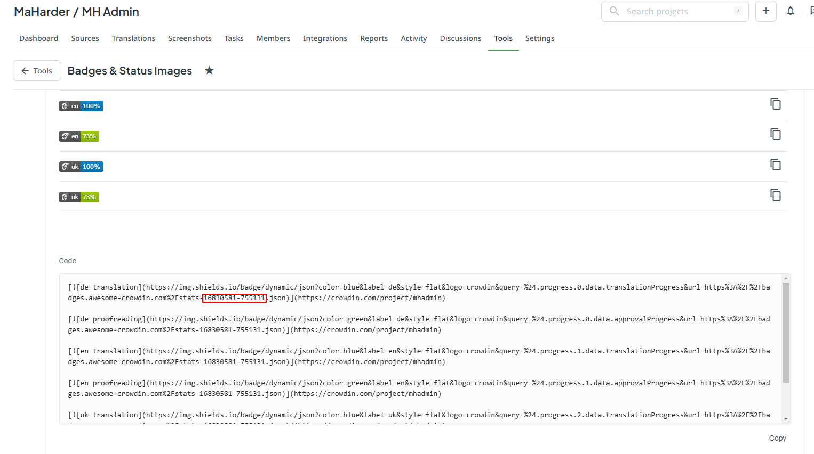

---
tags:
  - Инструкция
  - crowdin
  - Локализация
title: "Crowdin - Система локализаций"
description: "Инструкция по работе с Crowdin для локализации проектов DevCraft."
keywords: "Crowdin, локализация, переводы, DevCraft"
author: "Maxim Harder"
og:title: "Crowdin - локализация проектов"
og:description: "Инструкция по работе с Crowdin для локализации"
og:image: "https://devcraft.club/data/assets/logo_default/devcraftx2.png"
twitter:title: "Crowdin - локализация проектов"
twitter:description: "Инструкция по работе с Crowdin для локализации"
---

# Система локализаций Crowdin

Crowdin - платформа переводов локализаций. Именно эту платформу использую я для переводов.

## Как получить название проекта?

### Во время создания проекта

При создании проекта, Crowdin просит добавить уникальное название.

### После создания проекта

Переходим в проект и в адресной строке копируем последнее значение.
Пример:

- **Исходная ссылка**: https://crowdin.com/project/ **dle_faker**
- **Последнее значение**: dle_faker
  Название проекта: **dle_faker**

## Как получить ID статистики?

Для этого нужно установить / добавить в проект дополнение **[Badges & Status Images](https://crowdin.com/store/apps/bds)**.
Переходим в Tools > Badges & Status Images и включаем его.

После включения, скроллим вниз и в окне с кодами копируем код статистики.

