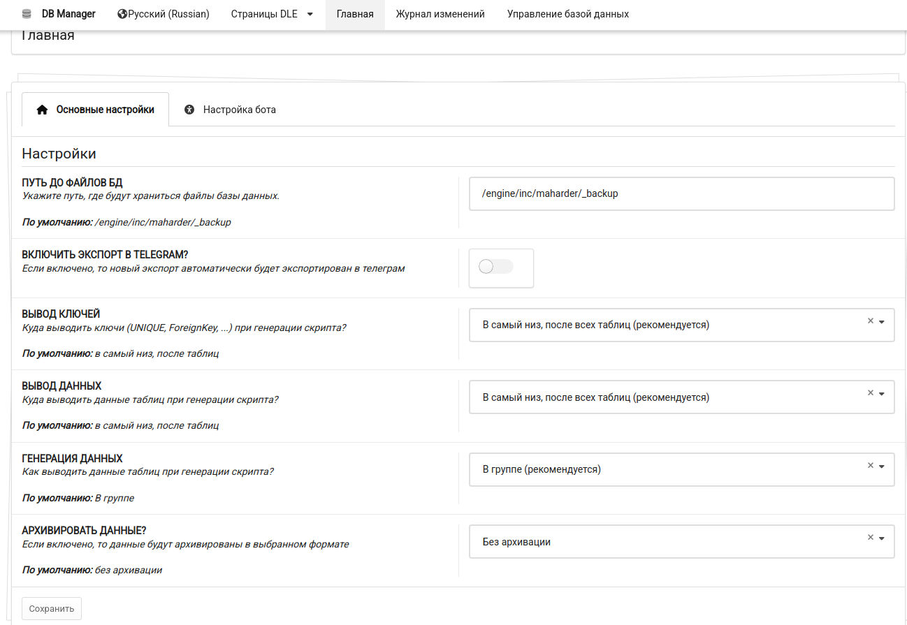
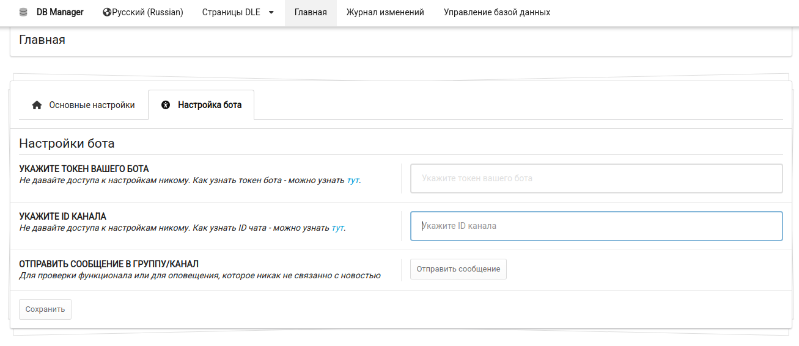
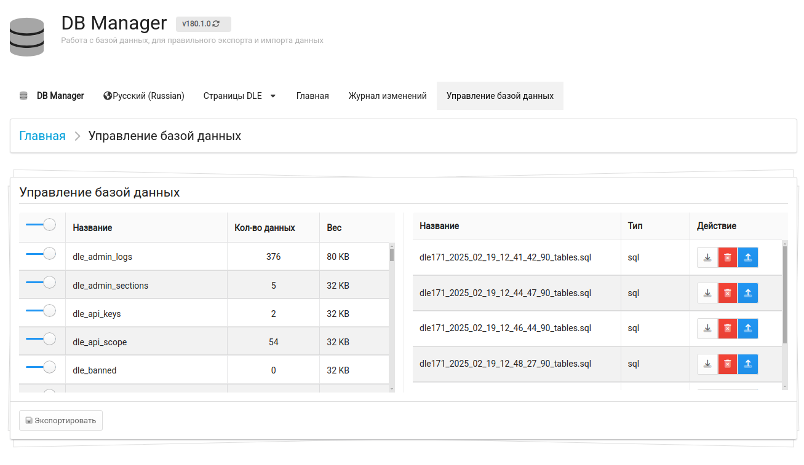

---
tags:
    - DLE
    - Плагин
    - PHP
    - База данных
    - бэкап
title: DB Manager
---
# DB Manager

Данный проект предназначался изначально для того, чтобы без проблем экспортировать данные с внешними ключами (Foreign Keys). Стандартный метод экспорта (от Sypex Dumper) к сожалению игнорирует данные ключи. Из-за чего возникает проблема с восстановлением данных. А поскольку я часто использую эти ключи, то частенько получаю сообщения об этом. Посему было решено написать простой плагин, который позволяет быстро экспортировать данные с внешними ключами.

Обратная совместимость со стандартным методом восстановления работает без проблем. В качестве бонуса я добавил экспорт данных в канал телеграма.

**Ссылка на разработку**: [<i class="fa-thin fa-paperclip"></i> Перейти к разработке](https://devcraft.club/downloads/db-manager.30/)

**Версия модификации**: <i class="fa-duotone fa-code-branch"></i> 180.1.0

## Установка

Смотри [инструкцию по установке](../install_instructions.md).

## Скриншоты

## Использование

Перед самим использованием нужно сохранить настройки, ибо по умолчанию они не проставляются. Можно просто сохранить пустые настройки, данные заданные по умолчанию проставятся сами. Но без файла конфигурации.

### Управление

На странице с управлением базой данных выводятся (слева) текущие таблицы в текущей базе данных. А так-же все созданные (справа) файлы для восстановления.

#### Таблица с файлами

Каждый файл можно спокойно скачать, удалить и / или восстановить.