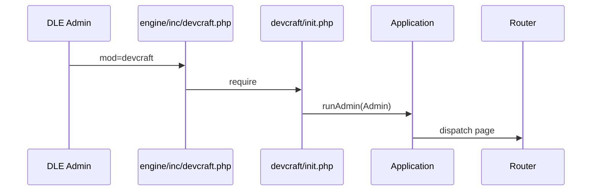
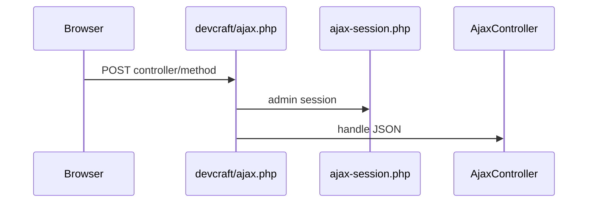

---
tags:
  - PHP
  - DLE
  - Плагин
  - Админка
title: "Точки входа - DevCraft Admin"
description: "Точки входа DevCraft Admin: DLE, bootstrap, AJAX."
keywords: "PHP, DLE, Плагин, Админка, точки входа, DevCraft, документация"
author: "Maxim Harder"
og:title: "Точки входа"
og:description: "Точки входа DevCraft Admin: DLE, bootstrap, AJAX."
og:image: "https://devcraft.club/data/assets/logo_default/devcraftx2.png"
---

# Точки входа

DevCraft Admin использует четыре основных входа в код плагина.

## 1. `engine/inc/devcraft.php`

Тонкая обёртка для DLE 20.0 Admin:

- проверяет константы `DATALIFEENGINE` и `LOGGED_IN`;
- подключает `devcraft/init.php`;
- вызывает `Application::instance()->runAdmin(moduleDir: 'Admin')`.

Это файл, который регистрируется в менеджере плагинов DLE как модуль админки.

## 2. `devcraft/init.php`

Bootstrap плагина:

- определяет `DEVCRAFT_BOOTSTRAPPED`;
- подключает `vendor/autoload.php` (Composer);
- при отсутствии `vendor/` выводит предупреждение в админке;
- регистрирует пути через `Paths::register()` и запускает ядро.

Используется и для админ-страниц, и как зависимость для AJAX.

## 3. `devcraft/ajax.php`

Тонкая точка входа для JSON/AJAX:

- эмулирует минимальное окружение DLE (`DATALIFEENGINE`, `ROOT_DIR`, `ENGINE_DIR`);
- подключает `devcraft/src/bootstrap/ajax-session.php` для сессии админки;
- загружает `init.php` и делегирует запрос `AjaxController`.

Типичный URL ядра: `/devcraft/ajax.php?controller=admin&method=settings`.

Для **сателлитных** модулей параметр **`mod` обязателен**, иначе реестр ищет метод в `devcraft` и отвечает `unknown_method`:

```text
/devcraft/ajax.php?mod=tags_add&controller=admin&method=save_suggestion
```

Клиент `DevCraft.Ajax.post(method, data)` подставляет `mod` из `body[data-mod]` (layout админки). Не вызывайте AJAX без `mod` для сателлитов.

## 4. `devcraft/src/bootstrap/`

| Файл | Назначение |
|------|------------|
| `functions.php` | Глобальные функции `__()`, `translate()`, `dirToArray()`, `br2nl()` |
| `ajax-session.php` | Минимальная авторизация админ-сессии до полного bootstrap |

## Поток запроса (админ-страница)



## Поток запроса (AJAX)



## См. также

- [Манифест модуля](manifest.md)
- [Класс Router](classes/Router.md)
- [Класс AjaxController](classes/AjaxController.md)
