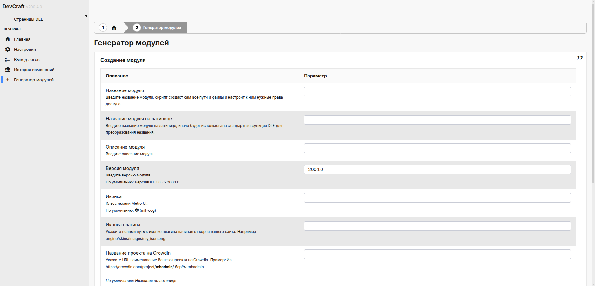

---
tags:
  - PHP
  - DLE
  - Плагин
  - Админка
title: "Генератор модулей - DevCraft Admin"
description: "Создание нового модуля DevCraft через админ-панель."
keywords: "PHP, DLE, Плагин, Админка, генератор модулей, DevCraft, документация"
author: "Maxim Harder"
og:title: "Генератор модулей"
og:description: "Создание нового модуля DevCraft через админ-панель."
og:image: "https://devcraft.club/data/assets/logo_default/devcraftx2.png"
---

# Генератор модулей

Функционал упрощает создание каркаса нового модуля DevCraft: страницы, AJAX, manifest, шаблоны и локализация.

Откройте в админке **DevCraft Admin → Генератор модулей** (`NewModulePage`).



## Форма

Укажите отображаемое имя модуля и код (латиница). Обработчик `NewModuleHandler` вызывает `ModuleGeneratorService`, который создаёт структуру под `devcraft/src/modules/{Name}/`.

## Создаваемая структура

```text
devcraft/src/modules/{Name}/
├── manifest.php
├── settings.schema.php      # при необходимости
├── changelog.data.php
├── Pages/
├── Ajax/
├── Services/
│   └── ModuleGeneratorService.php  # только в модуле Admin
├── Models/
├── Repositories/
├── templates/
│   └── *.twig
```


Точный набор файлов зависит от шаблона генератора (см. `ModuleGeneratorService` и `ModuleGeneratorInput` в [справочнике API](backend/classes/ModuleGeneratorService.md)).

## Регистрация в DLE

После генерации:

1. Проверьте `manifest.php` нового модуля (меню, AJAX, assets).
2. Убедитесь, что модуль появился в меню DLE.
3. При необходимости добавьте запись в менеджер плагинов DLE для отдельного `engine/inc/{mod}.php`.

## Возможные проблемы

- **Права на запись** — каталог `devcraft/src/modules/` должен быть доступен для PHP.
- **Дубликат кода** — транслит модуля должен быть уникальным.
- **Локализация** — сгенерированные фразы добавьте в XLIFF (см. [Генератор языковых файлов](generate_languages.md)).

## См. также

- [Манифест модуля](backend/manifest.md)
- [Класс ModuleGeneratorService](backend/classes/ModuleGeneratorService.md)

