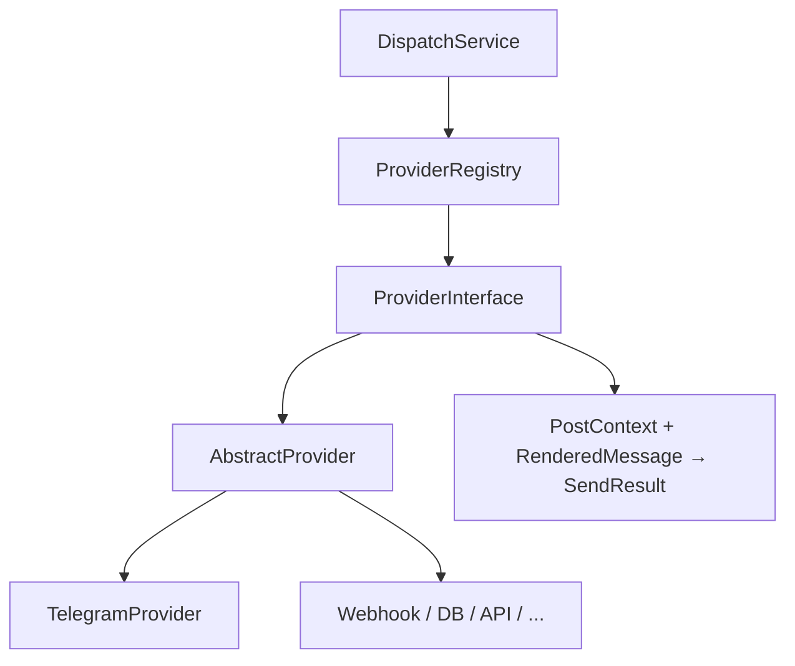

# Разработка каналов доставки

Провайдер RePost — **канал доставки**: Telegram, VK, webhook, своя БД, внешний API и т.п.  
Контракт: `ProviderInterface` → рекомендуется `extends AbstractProvider` → `send(…): SendResult`.



## Структура каталога

```text
devcraft/src/modules/RePost/Provider/
├── ProviderInterface.php
├── AbstractProvider.php          # ok/fail + mediaByteLimits + allowedMediaExtensions + filterMediaByLimits + templateTags()
├── TemplateTagsInterface.php
├── DefaultTemplateTags.php
├── ProviderRegistry.php
└── MyChannel/
    ├── init.php
    ├── settings.schema.php
    └── MyChannelProvider.php
```

## init.php

```php
return [
    'name'    => 'mychannel',
    'title'   => 'My Channel',
    'version' => '200.1.0',
    'class'   => \DevCraft\Modules\RePost\Provider\MyChannel\MyChannelProvider::class,
];
```

`ProviderRegistry` сканирует подкаталоги с `init.php` и регистрирует по ключу `name`.

## Обязательно: теги шаблона (`TemplateTagsInterface`)

Каждый канал **должен** вернуть реализацию из `templateTags()`:

- `implements TemplateTagsInterface` **или** `extends DefaultTemplateTags`
- свои HTML-теги канала — в `allowedHtmlTags()` / `sanitizeHtml()`
- UI-чипы редактора — `hints()`; post-pass — `applyAfterParse()`; плейсхолдеры — `extraPlaceholders()`

По умолчанию `AbstractProvider::templateTags()` → `DefaultTemplateTags`.  
Telegram: `TelegramTemplateTags` (кнопки, `[repost_media_*]`, allowlist Bot API).

```text
Provider/
  TemplateTagsInterface.php
  DefaultTemplateTags.php
  Telegram/TelegramTemplateTags.php
```

`ContentRenderer` вызывает tags выбранного подключения после `ParseTemplateTags::apply`.

## Обязательно: лимиты медиа

Каждый `extends AbstractProvider` **должен**:

1. Реализовать `mediaByteLimits(): array` — ключи `photo` / `video` / `audio` / `document` → байты. Нет ключа или `0` = без лимита для типа.
2. В `send()` **до аплоада** вызвать `filterMediaByLimits($message)` и работать уже с отфильтрованным `RenderedMessage`.

Локальные файлы больше лимита отбрасываются; публичный URL без локального файла остаётся (размер неизвестен). В `skipped` — список отброшенных (path, kind, bytes, limit).

Webhook / БД без лимитов:

```php
protected function mediaByteLimits(): array {
	return []; // фильтр всё равно вызывается — no-op по размеру
}
```

Telegram: см. `Provider/Telegram/MediaLimits.php` (photo 10 MiB, video/audio/document 50 MiB).

## Обязательно: расширения медиа (`allowedMediaExtensions`)

```php
/** @return array{photo: list<string>, video: list<string>, audio: list<string>, document: list<string>} */
public function allowedMediaExtensions(): array;
```

- Default в `AbstractProvider` — пустые списки (не фильтровать по расширению).
- Telegram: photo `jpg,jpeg,png,gif,webp`; video `mp4`; audio `mp3,m4a`; document — без жёсткого списка.
- Несовпадение заявленного типа с allowlist → переклассификация / отправка как document.
- Внешний `url=` перед аплоадом скачивается на сервер (`downloadRemoteMedia`); private/localhost — skip.

## Минимальный класс

```php
final class MyChannelProvider extends AbstractProvider {

	public static function code(): string {
		return 'mychannel';
	}

	public static function meta(): array {
		return [
			'name'    => 'mychannel',
			'title'   => 'My Channel',
			'version' => '200.1.0',
		];
	}

	protected function mediaByteLimits(): array {
		return [];
	}

	public function settingsSchema(): FormSchema {
		return require DLEPlugins::Check(__DIR__ . '/settings.schema.php');
	}

	public function send(
		PostContext $context,
		RenderedMessage $message,
		array $connectionConfig,
		?array $proxy = null,
	): SendResult {
		$filtered = $this->filterMediaByLimits($message);
		$message  = $filtered['message'];
		$skipped  = $filtered['skipped'];

		$url = trim((string) ($connectionConfig['webhook_url'] ?? ''));

		if($url === '') {
			return $this->fail(__('Не задан URL'));
		}

		// … доставка по $message …

		return $this->ok(__('Отправлено'), [
			'status'            => 200,
			'skipped_oversized' => $skipped,
		]);
	}
}
```

- `connectionConfig` — JSON из `settingsSchema()`.
- `RenderedMessage` уже отфильтрован по `tg_send_type` в ContentRenderer; лимиты размера — зона провайдера.
- Ошибки — `$this->fail()` → Admin logs (`LogGenerator::for('RePost')`).

## Примерный `settings.schema.php`

`FormSchemaBuilder` как в `Provider/Telegram/settings.schema.php`.

## Чеклист

1. Каталог `Provider/{Code}/` + `init.php` + класс + schema.
2. `extends AbstractProvider` + `mediaByteLimits()` + при необходимости `allowedMediaExtensions()`.
3. `templateTags()` — `DefaultTemplateTags` или свой класс (`TemplateTagsInterface`).
4. В `send()` вызвать `filterMediaByLimits()` до аплоада.
5. Подключение в админке → шаблон → add/edit или cron.

## Платные / внешние каналы

Каналы вроде **VK** поставляются **отдельным ZIP** (свой `install.xml` + дерево `upload/…/Provider/{Code}/`), а не патчами ядра RePost.

- `needplugin` → RePost
- Composer-зависимости канала — notice + при необходимости патч `composer_required` в `manifest.php` RePost
- Vendor в ZIP не кладётся

Пример: [providers/vk.md](../providers/vk.md) (RePost Provider: VK).
