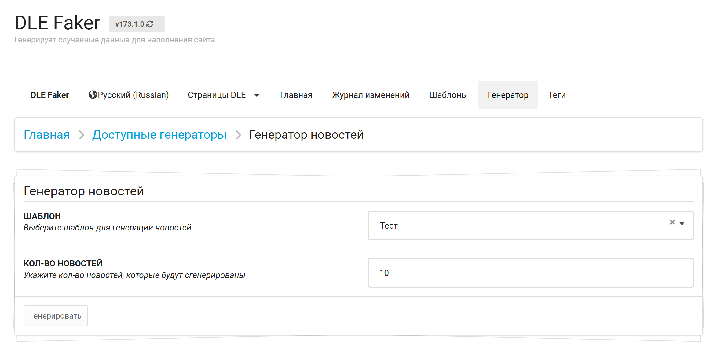
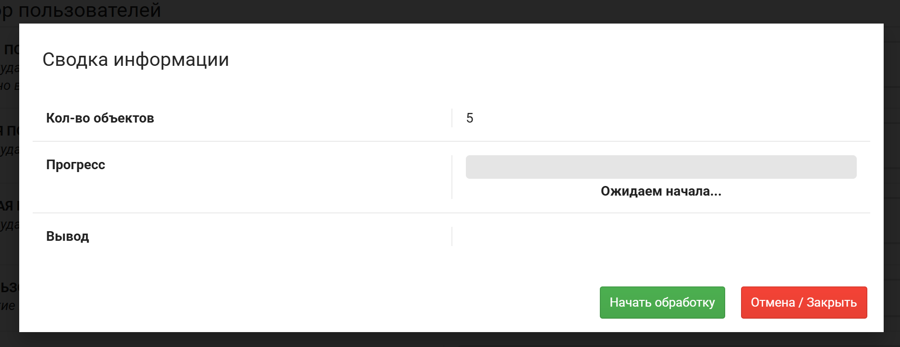
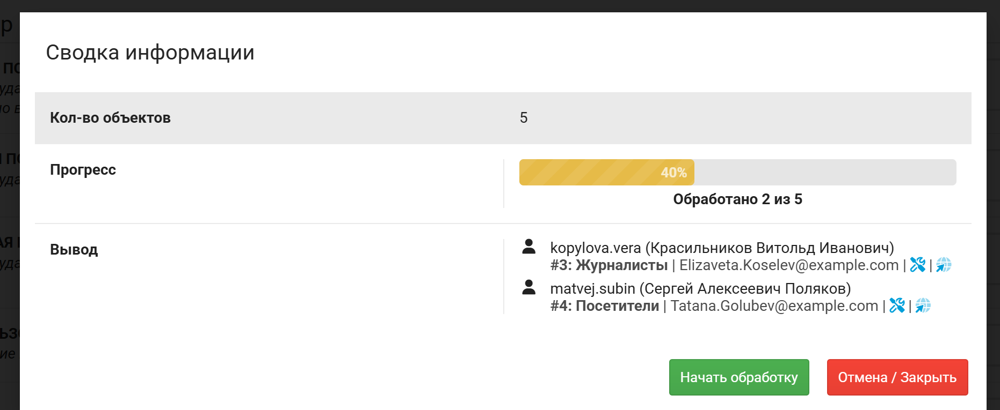

---
tags:
  - PHP
  - DLE
  - Плагин
  - Генератор
title: "Генератор новостей - DevCraft Документации"
description: "Документация по плагину генератор новостей для DLE."
keywords: "PHP, DLE, Плагин, Генератор, генератор новостей, DevCraft, документация"
author: "Maxim Harder"
og:title: "Генератор новостей"
og:description: "Документация по плагину генератор новостей для DLE."
og:image: "https://devcraft.club/data/assets/logo_default/devcraftx2.png"
twitter:title: "Генератор новостей"
twitter:description: "Документация по плагину генератор новостей для DLE."
---

# Генератор новостей

Генератор новостей работает по следующему принципу:
1. Создаётся шаблон (`/admin.php?mod=dle_faker&sites=template&action=create`)
2. Настраивается вывод информации
3. В генераторе выбирается нужный шаблон (`/admin.php?mod=dle_faker&sites=generator&action=news`)
4. Генерируется новость

Успешную генерацию новостей можно увидеть в списке во всплывшем окне.

Если в процессе произошла ошибка, то во всплывшем окне будет сообщение об этом. Их можно будет прочесть в логах, если данная функция MH Admin включена. А так-же процесс не достигнет 100%.

На данный момент не поддерживаются доп. поля с вложениями! Все остальные работают без проблем. Так-же генерируется статистика и логи DLE.