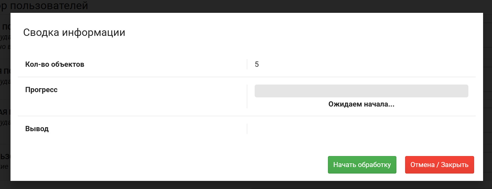
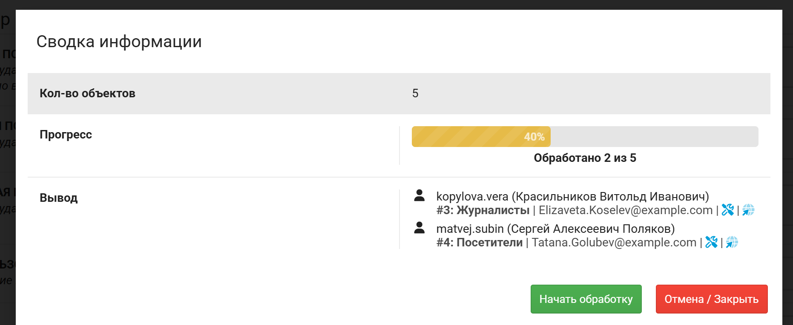

---
tags:
  - PHP
  - DLE
  - Плагин
  - Генератор
title: "Генератор пользователей - DevCraft Документации"
description: "Документация по плагину генератор пользователей для DLE."
keywords: "PHP, DLE, Плагин, Генератор, генератор пользователей, DevCraft, документация"
author: "Maxim Harder"
og:title: "Генератор пользователей"
og:description: "Документация по плагину генератор пользователей для DLE."
og:image: "https://devcraft.club/data/assets/logo_default/devcraftx2.png"
twitter:title: "Генератор пользователей"
twitter:description: "Документация по плагину генератор пользователей для DLE."
---

# Генератор пользователей

В отличие от генератора новостей, генератор пользователей не имеет шаблонов. И операция генерации настраивается с нуля.

В отличие от настроек, в этом генераторе значения по умолчанию проставлены.

Успешную генерацию пользователй можно увидеть в списке во всплывшем окне.

Если в процессе произошла ошибка, то во всплывшем окне будет сообщение об этом. Их можно будет прочесть в логах, если данная функция MH Admin включена. А так-же процесс не достигнет 100%.