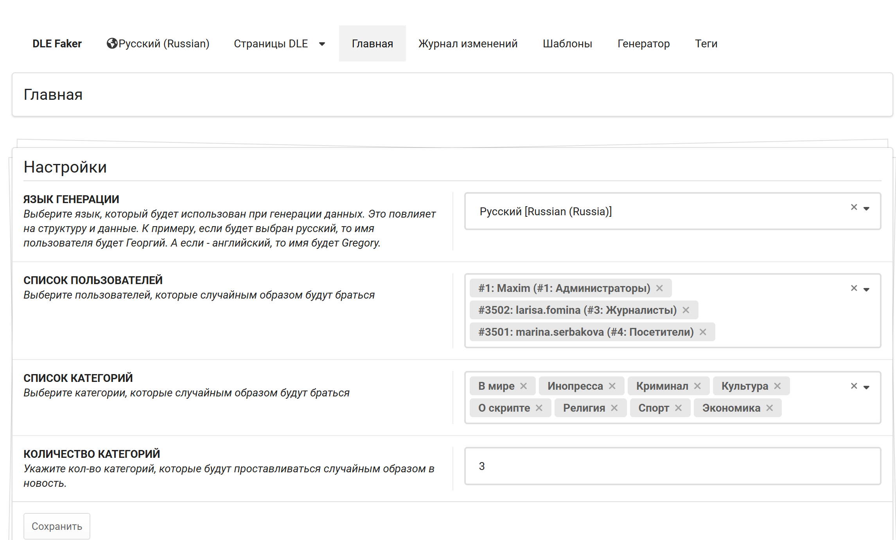

# Настройки

Настройки плагина являются главной страницей. Они обязательны к заполнению, ибо значений по умолчанию нет!

Несмотря на то, какой язык Вы веберите, генератор всёравно будет генерировать текст на латинице, а-ля Lorem Ipsum.