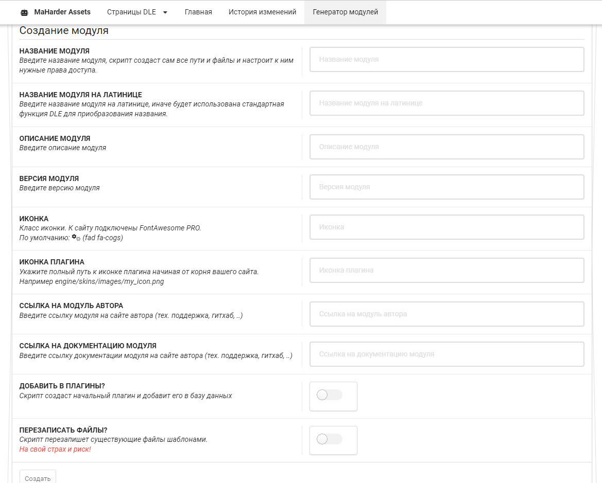

# Генератор модуля

Данный функционал был разработан для облегчённого добавления структуры разработки административной панели плагина.

## Форма добавления




## Структура файлов

Скрипт создаёт ряд папок и файлов

**Папки**:

```php
ROOT_DIR . '/engine/ajax/maharder/' . $mod_data['translit'],                            // Основная папка модуля для ajax запросов
ROOT_DIR . '/engine/inc/maharder/_modules/' . $mod_data['translit'],                    // Основная папка модуля в админпанели
ROOT_DIR . '/engine/inc/maharder/_modules/' . $mod_data['translit'] . '/module',        // Папка с основными файлами модуля
ROOT_DIR . '/engine/inc/maharder/_modules/' . $mod_data['translit'] . '/assets',        // Папка с ассетами модуля
ROOT_DIR . '/engine/inc/maharder/_modules/' . $mod_data['translit'] . '/models',        // Папка с моделями модуля (таблицами)
ROOT_DIR . '/engine/inc/maharder/_modules/' . $mod_data['translit'] . '/repositories',  // Папка с репозиториями модуля (для таблиц модуля)
ROOT_DIR . '/engine/inc/maharder/_modules/' . $mod_data['translit'] . '/utils',         // Папка с утилитами модуля (вспомогательными функциями)
ROOT_DIR . '/engine/inc/maharder/_templates/' . $mod_data['translit'],                  // Папка с шаблонами модуля
```

**Файлы**:

```php
ROOT_DIR . '/engine/ajax/maharder/' . $mod_data['translit'] . '/master.php',                        // Контроллер для ajax запросов
ROOT_DIR . '/engine/inc/maharder/admin/_modules/' . $mod_data['translit'] . '/assets/.htaccess',    // В папку с ассетами модуля, чтобы те были доступны
ROOT_DIR . '/engine/inc/maharder/admin/_modules/' . $mod_data['translit'] . '/module/changelog.php',// Файл с журналом изменений модуля
ROOT_DIR . '/engine/inc/' . $mod_data['translit'] . '.php',                                         // Файл для подключения в админке
ROOT_DIR . '/engine/inc/maharder/admin/_modules/' . $mod_data['translit'] . '/module/main.php',     // Файл главного модуля
ROOT_DIR . '/engine/inc/maharder/_templates/' . $mod_data['translit'] . '/main.html',               // Главный шаблон модуля
ROOT_DIR . '/engine/inc/maharder/_locales/ru_RU/' . $mod_data['translit'] . '.xliff',               // Файл локализации
```

## Возможные ошибки

1. При создании плагина плагин может произойти асечка, которая не даст добавить плагин в базу данных. Поэтому надо будет его добавить повторно, либо ручками
2. Проверяйте структуру файлов после генерации
3. Форматирования SQL кода в плагине может не соответствовать нужным параметрам, поэтому плагин будет выбрасывать ошибки - просто пересохраните плагин
4. Важно проверить, добавлены ли в действиях файлов изменения в файле `engine/inc/maharder/_includes/extras/paths.php`. Если таковых изменений нет, то их нужно добавить самому.
<ul>
   <li>Перед `// Custom models //` добавить

```php
  // Название модуля
  MH_ROOT . '/_modules/Название модуля латиницей/models',
  // Название модуля
```
</li>

<li>Перед `// Custom paths //` добавить

```php
  // Название модуля
  MH_ROOT . '/_modules/Название модуля латиницей/repositories',
  // Название модуля
```

</li>
</ul>