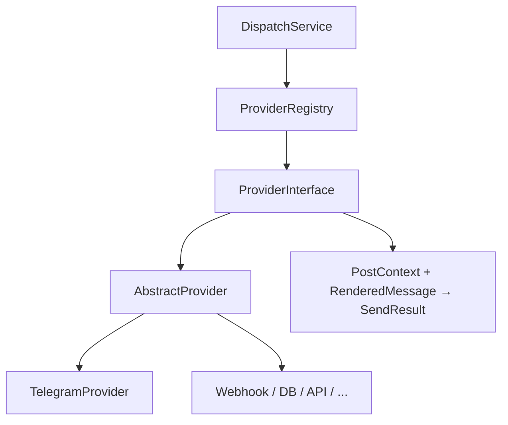

# Разработка каналов доставки

Провайдер RePost — **канал доставки**: Telegram, VK, webhook, своя БД, внешний API и т.п.  
Контракт один: `ProviderInterface` → `send(PostContext, RenderedMessage, connectionConfig, ?proxy): SendResult`.



## Структура каталога

```text
devcraft/src/modules/RePost/Provider/
├── ProviderInterface.php
├── AbstractProvider.php          # ok() / fail() → SendResult
├── ProviderRegistry.php
└── MyChannel/
    ├── init.php
    ├── settings.schema.php       # поля формы подключения
    └── MyChannelProvider.php
```

## init.php

```php
return [
    'name'    => 'mychannel',
    'title'   => 'My Channel',
    'version' => '200.1.0',
    'class'   => \DevCraft\Modules\RePost\Provider\MyChannel\MyChannelProvider::class,
];
```

`ProviderRegistry` сканирует подкаталоги с `init.php` и регистрирует по ключу `name`. API реестра менять не нужно.

## Минимальный класс

```php
final class MyChannelProvider extends AbstractProvider {

	public static function code(): string {
		return 'mychannel';
	}

	public static function meta(): array {
		return [
			'name'    => 'mychannel',
			'title'   => 'My Channel',
			'version' => '200.1.0',
		];
	}

	public function settingsSchema(): FormSchema {
		return require DLEPlugins::Check(__DIR__ . '/settings.schema.php');
	}

	public function send(
		PostContext $context,
		RenderedMessage $message,
		array $connectionConfig,
		?array $proxy = null,
	): SendResult {
		$url = trim((string) ($connectionConfig['webhook_url'] ?? ''));

		if($url === '') {
			return $this->fail(__('Не задан URL'));
		}

		// … доставка …

		return $this->ok(__('Отправлено'), ['status' => 200]);
	}
}
```

- `connectionConfig` — произвольный JSON из `settingsSchema()` (как у Telegram: `tg_bot`, `tg_chat_id`, `tg_send_type`).
- `RenderedMessage` уже отфильтрован по `tg_send_type` / аналогу: `text`, `images`, `videos`, `audios`, `buttons`.
- Ошибки возвращайте через `$this->fail()` — `DispatchService` пишет их в Admin logs (`LogGenerator::for('RePost')`, уровень `error`). Успех — `info`; подробности match/media — `debug` при включённом debug DevCraft.

## Примерный `settings.schema.php`

Используйте `FormSchemaBuilder` (как в `Provider/Telegram/settings.schema.php`): поля text/select/checkbox, без секретов в логах.

## Чеклист

1. Каталог `Provider/{Code}/` + `init.php` + класс + schema.
2. `extends AbstractProvider` (или прямой `implements ProviderInterface`).
3. Подключение в админке → выбрать провайдер → сохранить config.
4. Шаблон на это подключение → add/edit новости или cron.
