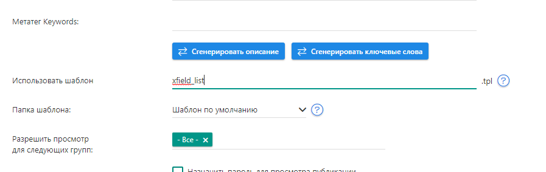

# XF List Generator

**Ссылка на
разработку**: [<i class="fa-thin fa-paperclip"></i> Перейти к разработке](https://devcraft.club/downloads/xf-list-generator.19/)

**Версия модификации**: <i class="fa-duotone fa-code-branch"></i> 1.1.0

## Установка

Либо закинуть файл xf_list_gen.php в папку engine/modules, либо установить плагин через менеджер плагинов

## Подключение

Модуль подключается в любом шаблоне при помощи инклуда:

```html
{include file="engine/modules/xf_list_gen.php?xffield=X&template=X&&limit=X&skip=X&sort=X&cat=X&news_id=X"
```

## Отображение списка на отдельной странице

* Создаём шаблон в папке вашего шаблона, к примеру /templates/Default/**xfield_list.tpl**
* В этот шаблон подключаем инклуд. Используем данные из статического шаблона **static.tpl** и дополняем его:

```HTML
<article class="box story">
	<div class="box_in">
		[group=1]<ul class="story_icons">
			<li class="edit_btn">
				[edit]<i title="Редактировать">Редактировать</i>[/edit]
			</li>
		</ul>[/group]
		<h1 class="title">{description}</h1>
		<div class="text">{include file="engine/modules/xf_list_gen.php?xffield=X&template=Y}</div>
	</div>
</article>
```

* Вместо X - название доп. поля. Вместо Y - путь до шаблона для списка
* Создаём статическую страницу в админпанеле и указываем в поле название созданного шаблона

* Всё

## Теги

**Обязательные теги**

* **xffield** - Название доп. поля
* **template** - Название шаблона с окончанием

**Дополнительные теги:**

* **limit** - Ограничивает вывод записей в списке, принимает только числа. По умолчанию: пусто
* **skip** - Пропускает заданное число записей, принимает только числа. По умолчанию: пусто
* **sort** - Сортировка списка, по умолчанию или по убыванию. Принимает только ASC и DESC. По умолчанию: ASC
* **cat** - Перечень категорий через запятую (,) из которых должны формироваться списки # начиная с версии 1.1.0
* **news_id** - Перечень новостей через запятую (,) из которых должны формироваться списки # начиная с версии 1.1.0

**Возможные теги в вашем шаблоне:**

* **{link}** - Выводит ссылку на доп. поле, если имеется (хотя да...)
* **{name}** - Название доп. поля
* **{value}** - Значение доп. поля
* **{max_value}** - Максимально возможное значение, сделано для вывода чисел
* **{min_value}** - Минимально возможное значение, сделано для вывода чисел
* **{count}** - Выводит общее количество использования доп. поля # начиная с версии 1.1.0
